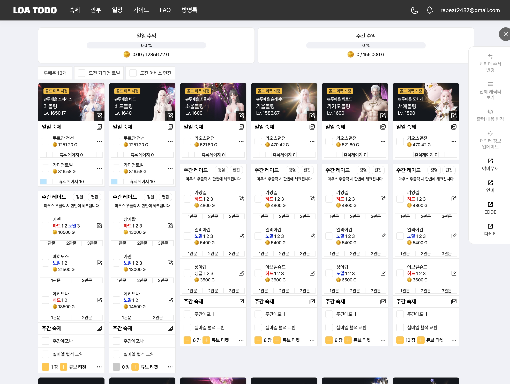

# 로스트아크 일정 관리 사이트 "로아투두"
### https://app.loatodo.com

# 프로젝트 구조
### 주요 기능
- 캐릭터 데이터 호출
    - 로스트아크 오픈 API로 캐릭터 데이터 호출
- 로스트아크 일일, 주간 숙제(일정) 관리
    - 일일 컨텐츠 : 카오스 던전, 가디언 토벌, 에포나 의뢰
        - 로스트아크 오픈 API의 거래소, 경매장 등의 데이터를 호출해 예상 수익 계산
        - 체크한 내용을 바탕으로 휴식게이지 계산 -> 인게임과 동일한 휴식게이지
    - 주간 레이드 : 카제로스 레이드, 군단장 레이드, 어비스 던전, 어비스레이드
        - 주간 수익 계산
        - 몇 개의 2주 주기 컨텐츠 계산 (카멘 4관문, 아브렐슈드 4관문)
    - 커스텀 메뉴 : 등록된 항목 외의 사용자 임의로 항목 추가 가능(일일, 주간)
    - 일일 컨텐츠는 매일 오전 6시, 주간 컨텐츠는 매주 수요일 오전 6시에 초기화
- 깐부
  - 다른 사용자의 숙제 탭 내용 공유
  - 각 항목마다 권한을 부여할 수 있음
- 일정
  - 캘린더 형식의 일정 등록 기능
- 방명록
- 알림 기능
    - 공지사항, 방명록 댓글, 깐부 신청/수락/거절시 사이트내 알림 전송
- 유틸리티
    - 큐브 계산기 : 큐브 컨텐츠의 통계를 바탕으로 예상 수익 계산
- 모집 게시판 (개발중)
  - 깐부, 길드, 공격대 모집/홍보 게시판 개발중

### GA 성과 (2024.10.14)

### 기술스택
- Programing Languages : Java, TypeScript, HTML5, CSS3
- Framework : SpringBoot, React
- Library : JPA, QueryDSL, Spring Security, Spring Cache, Swagger, JWT, Recoil, React-Query
- Tooling / DevOps : Redis, Docker, Git, Figma
- Environment : AWS (EC2, RDS, S3, ECR, ECS, CodePipeline, ElastiCache)
- DB : MySQL
- Etc : Jira, Confluence, Discord

### 인력 구성
- PM, 백엔드 개발 1 (본인)
- UI/UX 기획, 퍼블리셔 1
- 프론트엔드 개발 1

### 운영 기록
- 2023.07.02 ~ 2023.09.10 - 기본 기능 개발
- 2023.09.11 - 베타 버전 배포
- 2023.10.10 - 메인 기능(숙제 관리) 배포 완료
- 2023.12.01 - 친구 기능 추가 완료
- 2024.01.10 - 이메일 인증 로그인 구현
- 2024.02.21 - 홈 화면 리빌딩
- 2024.06.01 - 타입스크립트, React Query, Recoil을 사용하여 프론트엔드 재구축
- 2024.06.16 - 백엔드서버 RI 및 CI/CD 환경 구성
- 2024.07.10 - 알림 기능 추가
- 2024.10.13 - 큐브 계산기 기능 추가

### Github
- [Backend](https://github.com/minhyeok2487/LostarktTodoBackend)
- [Frontend](https://github.com/minhyeok2487/LoatodoFrontWithTs)

### 참고 사이트
* [로스트아크 오픈 API](https://developer-lostark.game.onstove.com/getting-started)
* [빈아크](https://ark.bynn.kr/to-do)
* [클로아(디자인 참고)](https://kloa.gg)

## 회고
- **2024.06.16 / 백엔드서버 RI 및 CI/CD 환경 구성**
  - 기존 ElasticBeanstalk으로 운영하던 비용이 부담되서 서버비용 감축을 위함
  - AWS Code Build, Code Pipeline, ECR, ECS 사용 
  - 예약 인스턴스(RI)를 이용하여 서버비용 감축
  - 블로그 정리
    - https://repeater2487.tistory.com/193
    - https://repeater2487.tistory.com/196
    - https://repeater2487.tistory.com/197
- **2024.06.01 / 프론트엔트 환경 재구축**
  - useState만을 사용하여 관리하니 유지보수에 어려움을 느낌
  - 타입스크립트, React Query, Recoil 사용
  - 위 라이브러리를 사용하여 기능 추가 및 개선 용이
- **2024.02.26 / 전략패턴을 이용한 코드 리팩토링**
  - boolean 형식으로 저장 후 IF문을 이용하여 정책을 분리해서 구현한 메소드
  - ENUM과 전략패턴을 이용하여 로직 분리
  - 추후 새로운 정책 추가 용이
  - https://repeater2487.tistory.com/183
- **2023.12.31 ~ 2024.02.01 / Redis에 관하여**
  - 초기 이메일 인증 로직을 Redis 이용하여 구현
    - 이때 인증 번호 저장용으로 Redis 서버를 AWS ElastiCache 사용
  - 비용적인 문제로 위 서버를 내리고 기존 RDBMS 테이블에 저장하는 방식으로 변경함
  - https://repeater2487.tistory.com/182
- **2023.11.24 / N+1 문제 리팩토링**
  - 1:N 관계 테이블 4개를 호출해서 SELECT 문이 여러번 실행
    - (Member - Characters - Content, todoV2)
  - JPQL JOIN FETCH로 변경
  - 단, 이렇게 했을때 특정 테이블(todoV2)의 값이 없으면 데이터를 불러오지 않아 3개의 테이블만 연결 
    - → 해당 문제 LEFT JOIN으로 해결 (Member - Characters - Content)
  - https://repeater2487.tistory.com/164
- **2023.11.08 / 메모리 부족으로 인한 서버다운**
  - 약 10만건의 데이터 JPA 더티체킹 업데이트로 인한 메모리 부족 문제
  - JPQL 문법으로 변경으로 해결(Bulk 업데이트)
  - https://repeater2487.tistory.com/163
- **2023.10.30 / 주간 숙제 완료 시 수치가 초과되는 문제 해결**
  - 백엔드와 프론트 로직 문제
  - https://repeater2487.tistory.com/158
- **기타**
  - 2023.08.01 / int와 Integer, boolean과 Boolean
    - https://repeater2487.tistory.com/137
  - 2023.07.28 / 빌더 패턴
    - https://repeater2487.tistory.com/135
    - https://repeater2487.tistory.com/136
  - 2023.07.26 / API 문서 자동화 Swagger
    - https://repeater2487.tistory.com/134
  - 2023.07.06 / fetch join을 활용한 LAZY 호출 최적화
    - https://repeater2487.tistory.com/129
  - 2023.07.08 / Auditing을 활용한 엔티티 생성/수정 시각 자동화
    - https://repeater2487.tistory.com/131
  - 2023.07.07 / JPQL을 활용한 쿼리 작성
    - https://repeater2487.tistory.com/130
