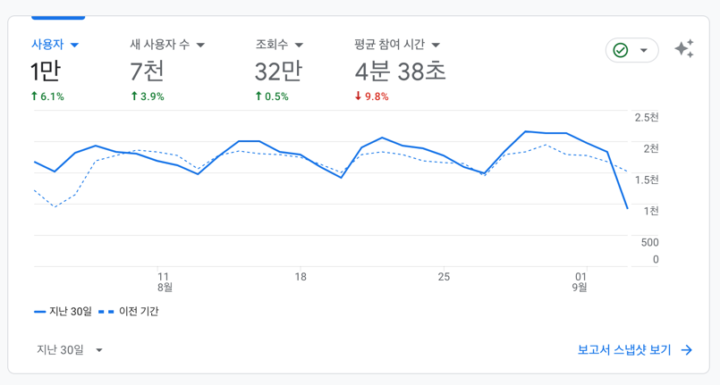

# 로스트아크 숙제 체크 사이트
## https://app.loatodo.com

## Github
- [Backend](https://github.com/minhyeok2487/LostarktTodoBackend)
- [Frontend](https://github.com/minhyeok2487/LostarkTodoFrontend)

## 프로젝트
### 개요
- 로스트아크 일일, 주간 컨텐츠 관리 사이트
    - 일일 컨텐츠 : 카오스 던전, 가디언 토벌, 에포나 의뢰
        - 로스트아크 오픈 API의 거래소, 경매장 등의 데이터를 호출해 예상 수익 계산
        - 체크한 내용을 바탕으로 휴식게이지 계산 -> 인게임과 동일한 휴식게이지
    - 주간 컨텐츠 : 군단장 레이드, 어비스 던전, 어비스레이드
        - 주간 수익 계산
        - 몇 개의 2주 주기 컨텐츠 계산
- 컨텐츠 완료 한 기록 저장 (개발중)

### 기간
* 2023.08.02 ~ 2023.09.10(기본 기능 개발)
* 2023.09.11 베타 버전 배포

### 주요 기능
#### 1. 가입
* 구글 로그인으로 가입 가능
* ApiKey, 대표캐릭터 -> ApiKey 가 필수이기 때문에 로스트아크 서버 점검 중에는 가입불가

#### 2. Todo
* 캐릭터 Info
  * 캐릭터 이미지 안에 클래스, 서버, 아이템 레벨, 캐릭터 이름 출력
* 일일 숙제 체크
  * 돋보기 클릭 시 재료 통계와 시세 보기
  * 하단 녹새 바 클릭 시 휴식게이지 수정
  * 매일 오전 6시 휴식게이지 계산 후 초기화
* 주간 숙제 관리
  * 원하는 컨텐츠 체크 후 저장
  * 같은 레이드 동시 선택 불가 (예시 - 카양겔(노말), 카양겔(하드))
  * 골드 획득이 높은 순으로 정렬 -> 3개 주간 골드로 포함
  * 관문 통합과 관문 분리 -> 2가지 버전으로 개발
* 서버별 출력 분리
* 주간 원정대 숙제 체크
  * 도전 어비스 던전
  * 도전 가디언 토벌
* 수익 / 예상 수익
  * 일일 수익 / 예상 일일 수익
  * 주간 수익 / 예상 주간 수익 -> 단, 골드 획득 지정 캐릭터만
* 골드 획득 캐릭터 지정

### 참고 사이트
* [로스트아크 오픈 API](https://developer-lostark.game.onstove.com/getting-started)
* [빈아크](https://ark.bynn.kr/to-do)
* [클로아(디자인 참고)](https://kloa.gg)

## STACKS
### Environment

  
  
  

### Backend Development

  
  
  

### Frontend Development

### DataBase

  

### Communication

## 문서 정리
### Backend 프로젝트 진행 중 성장
* [JPA N+1 문제](https://repeater2487.tistory.com/129)
* [JPQL 사용](https://repeater2487.tistory.com/130)
* [엔티티 생성/수정 시각 자동화 Auditing](https://repeater2487.tistory.com/131)
* [API 문서 자동화 Swagger](https://repeater2487.tistory.com/134)
* [빌더 패턴 (with Lombok)](https://repeater2487.tistory.com/135)
* [일대다 매핑과 빌더 패턴](https://repeater2487.tistory.com/136)
* [int와 Integer, boolean과 Boolean](https://repeater2487.tistory.com/137)
